# Architecture

One file per tool, no runtime dependencies, no build step for consumers. Each
tool is a single script you link from Code Injection, and each is independent
of the other.

```mermaid
flowchart TD
    subgraph repo["1 . Source"]
        SRC1["dates/sqs-dates.js<br>parser + formatter + DOM scanner"]
        SRC2["counter/sqs-counter.js<br>literal reader + planner + ticker"]
        TESTS["test/*.test.mjs<br>node --test, vm sandbox, no deps"]
        BUILD["build.sh<br>terser, then the tests"]
        MIN1["dates/sqs-dates.min.js"]
        MIN2["counter/sqs-counter.min.js"]
        DEMO["counter/demo.html<br>every mode, served locally"]
        SRC1 --> BUILD
        SRC2 --> BUILD
        BUILD --> MIN1
        BUILD --> MIN2
        BUILD --> TESTS
        SRC2 --> DEMO
    end

    subgraph cdn["2 . Delivery"]
        TAG["git tag v1.5.0<br>not cut yet"]
        JSD(["jsDelivr<br>cdn.jsdelivr.net/gh/3bdigital/..."])
        MIN1 -.-> TAG
        MIN2 -.-> TAG
        TAG -.-> JSD
    end

    subgraph site["3 . Any Squarespace 7.1 site"]
        INJ{{"Code Injection<br>one script tag per tool"}}
        GUARD{"framed by the editor<br>or the preview?"}
        STOP["do nothing<br>no writes, no markers, log why"]
        WATCH["watch html and body class<br>for edit mode arriving later"]
        UNDO["shutdown(): put every counter back<br>to the markup it came from,<br>drop observers, cancel animations"]
        INJ --> GUARD
        GUARD -->|yes| STOP
        WATCH --> UNDO
    end

    subgraph dates["4 . sqs-dates, on every page"]
        DSCAN["scan(): querySelectorAll(include)"]
        DSKIP{"matches exclude?"}
        DRES["resolve(el), best source first<br>1 datetime attr, if real ISO<br>2 visible text, locale-aware parse<br>3 meta datePublished, item pages only"]
        DEVENT{"event?"}
        DFMT["format(parts, format or eventFormat)"]
        DWRITE["write innermost node<br>+ repair the datetime attr"]
        DOBS["MutationObserver<br>load more, ajax"]
        DSCAN --> DSKIP
        DSKIP -->|no| DRES --> DEVENT --> DFMT --> DWRITE
        DOBS --> DSCAN
    end

    subgraph counter["5 . sqs-counter, on every page"]
        CTEXT["scanText(): text, markdown, code blocks<br>&#123;&#123;101 | 3s&#125;&#125; becomes a .sqs-counter span<br>with data-counter- attributes"]
        CEARLY["parse-time observer<br>childList + characterData<br>converts markers as text arrives"]
        CHIDE{"data-counter-hide set?"}
        CSTYLE["hide the text until parsed<br>revealed at DOMContentLoaded<br>or after 4s regardless"]
        CEL["scanElements(): .sqs-counter"]
        CPARSE["parse(): read the number as written<br>value, decimals, grouping, prefix, suffix"]
        CPLAN["buildPlan(): whole units of the precision<br>from, to, step, duration or speed, easing"]
        CMOUNT["mount(): aria-hidden value span<br>+ hidden final value for screen readers<br>+ reserve the finished width"]
        CRM{"prefers-reduced-motion?"}
        CFINAL["show the final value, no animation"]
        CIO{"in the viewport?"}
        CTICK["one requestAnimationFrame loop<br>for every running counter"]
        CQ["unitsAt(): elapsed time, eased,<br>snapped to a step, never past the target"]
        CPAINT["textContent, at most fps times a second"]
        COBS["MutationObserver<br>ajax page changes"]
        CHIDE -->|yes| CSTYLE
        CHIDE -->|no| CTEXT
        CSTYLE --> CTEXT
        CEARLY --> CTEXT
        CTEXT --> CPARSE
        CEL --> CPARSE
        CPARSE --> CPLAN --> CMOUNT --> CRM
        CRM -->|yes| CFINAL
        CRM -->|no| CIO
        CIO -->|yes| CTICK --> CQ --> CPAINT
        COBS --> CTEXT
        COBS --> CEL
    end

    JSD -.-> INJ
    GUARD -->|no| DSCAN
    GUARD -->|no| WATCH
    GUARD -->|no| CHIDE
    GUARD -->|no| CEL

    classDef built fill:#e9f6ef,stroke:#0d9268,stroke-width:2px,color:#111
    classDef todo fill:#fdeceb,stroke:#e03131,stroke-width:2px,color:#111
    class SRC1,SRC2,TESTS,BUILD,MIN1,MIN2,DEMO,INJ,GUARD,STOP,DSCAN,DSKIP,DRES,DEVENT,DFMT,DWRITE,DOBS,CTEXT,CEL,CPARSE,CPLAN,CMOUNT,CRM,CFINAL,CIO,CTICK,CQ,CPAINT,COBS,CEARLY,CHIDE,CSTYLE,WATCH,UNDO built
    class TAG,JSD todo
```



Rectangles are code that runs, diamonds are real branches, the hexagon is a
surface someone edits in Squarespace, and the stadium is somebody else's
infrastructure.

## Not built yet

| Box | What is missing | Evidence |
| --- | --- | --- |
| `git tag v1.5.0` | The counter is on a branch and has never been tagged | `git tag` lists v1.0.0 to v1.4.0 |
| jsDelivr URL for the counter | Follows the tag; the URL in the READMEs will 404 until then | jsDelivr serves `/gh/` from tags |

A third tool would be a new folder alongside `dates/` and `counter/`, the same
one-file-one-script-tag shape, a row in the root README, and its own tests.

## Versions

There is no npm package here. jsDelivr serves files straight from a GitHub tag,
so a tag versions the **repository**, not a tool:

```text
cdn.jsdelivr.net/gh/3bdigital/squarespace-tools@v1.4.0/dates/sqs-dates.min.js
```

A pinned URL is a snapshot of the repo at that tag and cannot change, so adding
the counter at `v1.5.0` cannot affect a site pinned to `v1.4.0`, and a site that
moves to `v1.5.0` gets a byte-identical dates file. Per-tool tags
(`dates-v1.4.0`) are possible, and jsDelivr would serve them, but they would
break every URL already in the wild for no gain while the tools stay
independent. See the changelog, which labels each entry with the tool it
affects.

## Why the date is resolved in that order

Squarespace is inconsistent about what it gives you:

| Surface | Machine-readable date? |
| --- | --- |
| Event list and event item | yes, a real ISO `datetime` |
| Blog post page | no, `datetime` holds a display string like `10 Apr` |
| Blog list and grid | no `datetime` at all |
| Summary blocks | no, and not a `<time>` element |

So the script takes whichever source it can get, in descending order of trust,
and refuses to guess when it has none. The `datetime` attribute goes first but
is distrusted unless it looks like ISO, because 7.1 puts display strings in it.

## Why exclusions are exact class names

They started as substring matches, and `[class*="event-time"]` matched a
summary block's settings class,
`summary-block-setting-secondary-metadata-event-time`, silently excluding the
whole block. Squarespace encodes block configuration into class names, so
substring matching against them is unsafe. The exclusions name elements
exactly: event times, the day/month tiles, and calendar blocks.

## Why neither tool runs in the editor

The editor loads the site in a frame and reads the live DOM when it saves. A
script that rewrites content there can have its changes, or its marker
attributes, written into the saved page. For the counter the stakes are higher
still: it replaces a typed `{{101}}` with a `<span>`, and a save would make that
permanent, losing the source of the counter. The guard is a frame check, which
costs nothing because the live site is never framed.

That guard only sees the page it loaded into, which is the gap the counter also
closes. Squarespace can start the editor up in a document that is already
running, and a script still mutating the DOM while the editor renders is a good
way to see a section drawn twice. So the counter watches `html` and `body` for
an `sqs-edit-mode` class arriving and, if it does, puts every counter back to
the markup it came from, marker text included, then drops every observer and
cancels every animation. Verified by comparing the live DOM against the
server's own response: identical, with nothing of the script left in it.

`sqs-dates` has the same gap and has not had the same treatment. It would need
to keep each element's original text to undo itself, which it does not
currently do.

## Why the counter reads the number you wrote

A stat is a piece of design. `1,000+` and `$6bn+` are how it has to end up, and
the person editing the site is looking at that string, not at a configuration
table. So the literal is the configuration: separators in it mean grouping,
decimals in it set the precision, and anything either side of the digits is
prefix and suffix. The alternative, four attributes describing a number that is
also written out next to them, gets out of step the first time someone edits
one and not the other.

That is also why the text block form exists. A code block renders in the site's
body font, so a display number built in one cannot be styled with Squarespace's
own heading controls. Typing `{{101}}` into an ordinary text block leaves the
styling entirely to Squarespace, and the script replaces only the number.

A marker is turned into the same `.sqs-counter` element a code block would
contain, with its pipe options written on as real `data-counter-` attributes,
so there is one code path from there on and devtools shows the same thing
either way.

## Why counters are timed, not stepped

Counting a fixed amount per frame ties the length of the animation to the
refresh rate: the same counter takes half as long on a 120Hz phone. So the
position is a function of elapsed time, and `step` only quantises what is
displayed. A row of stats therefore finishes together whatever they count to,
which is what a row of stats wants. `speed` is there for the case where it
should not, and it is converted to a duration up front rather than driving the
loop.

Frames are capped at 200ms so a backgrounded tab pauses rather than jumping to
the end, and repaints are capped at 30 a second so nine digits do not scramble.

## Why there are two observers

The one that runs while the page is parsing watches `characterData` as well as
`childList`, because the parser usually grows a text node a network chunk at a
time rather than inserting it whole. A marker split across two chunks is
therefore seen once as `{{10`, which matches nothing, and watching only for
added nodes would never look at it again until the page had been drawn. It is
disconnected at `DOMContentLoaded`, because from then on `characterData` fires
on every repaint of every running counter.

Even so, nothing inside the page can guarantee a marker is replaced before its
own text is painted: that depends on how the document arrives over the network.
`data-counter-hide` is the way out, and it is opt-in because it trades a
certain moment of missing text for an uncertain moment of braces.
