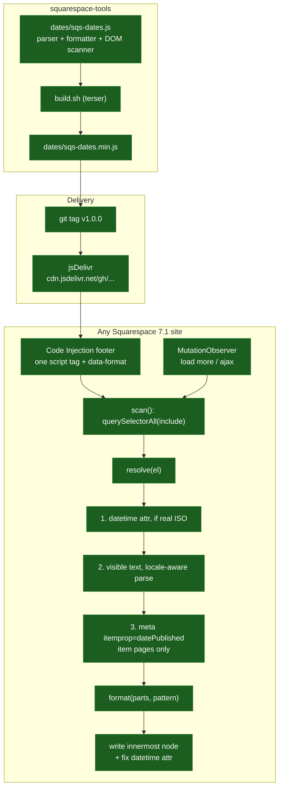

# Architecture

One file per tool, no runtime dependencies, no build step for consumers.

Everything is built. Adding a second tool means a new folder alongside
`dates/`, the same one-file-one-script-tag shape, and a row in the root README.

## Why the date is resolved in that order

Squarespace gives a machine-readable date on item pages only, and a
locale-formatted string everywhere else. Neither is available in both places,
so the script takes whichever it can get and refuses to guess when it has
neither. The `datetime` attribute goes first but is distrusted unless it looks
like ISO, because 7.1 puts display strings in it.
