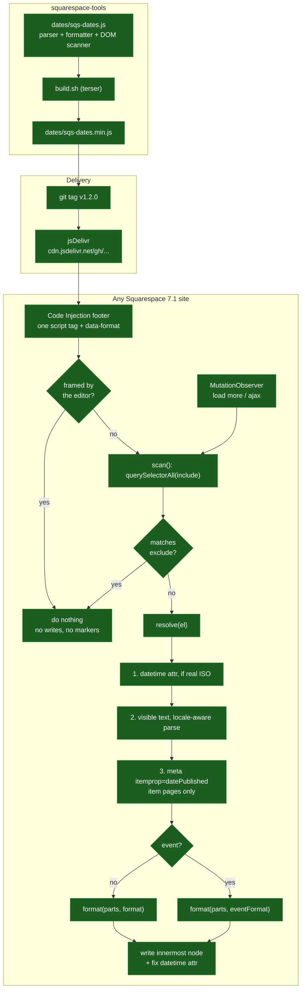

# Architecture

One file per tool, no runtime dependencies, no build step for consumers.

A second tool would be a new folder alongside `dates/`, the same
one-file-one-script-tag shape, and a row in the root README.

## Why the date is resolved in that order

Squarespace is inconsistent about what it gives you:

| Surface | Machine-readable date? |
| --- | --- |
| Event list and event item | yes, a real ISO `datetime` |
| Blog post page | no, `datetime` holds a display string like `10 Apr` |
| Blog list and grid | no `datetime` at all |
| Summary blocks | no, and not a `<time>` element |

So the script takes whichever source it can get, in descending order of trust,
and refuses to guess when it has none. The `datetime` attribute goes first but
is distrusted unless it looks like ISO, because 7.1 puts display strings in it.

## Why it does not run in the editor

The editor loads the site in a frame and reads the live DOM when it saves. A
script that rewrites content there can have its changes, or its
`data-sqs-dates` markers, written into the saved page. The guard is a frame
check, which costs nothing because the live site is never framed.

## Why exclusions are exact class names

They started as substring matches, and `[class*="event-time"]` matched a
summary block's settings class,
`summary-block-setting-secondary-metadata-event-time`, silently excluding the
whole block. Squarespace encodes block configuration into class names, so
substring matching against them is unsafe. The exclusions name elements
exactly: event times, the day/month tiles, and calendar blocks.
